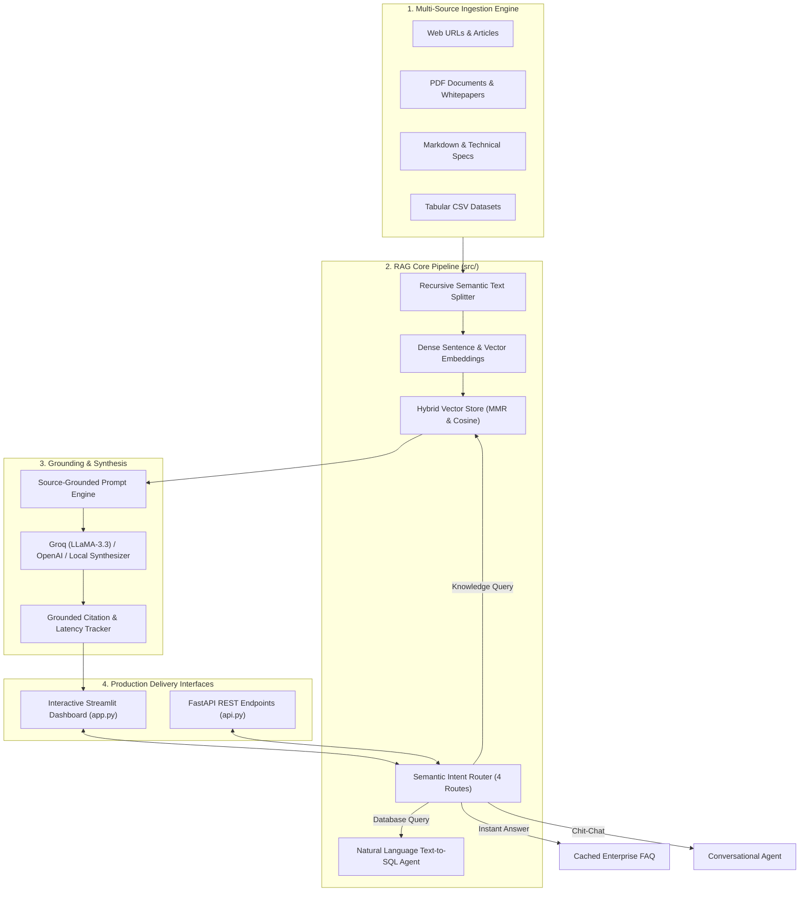

# ⚡ #GyanLabs-Enterprise-RAG: Advanced Multi-Source Retrieval-Augmented Generation Platform

[](https://www.python.org/)
[](https://streamlit.io/)
[](https://fastapi.tiangolo.com/)
[](https://github.com/langchain-ai/langchain)
[](https://opensource.org/licenses/MIT)

> [!NOTE]
> **Educational & Research Demonstration Disclaimer:**  
> This project, including the fictitious enterprise identity ("#Gyan Labs / HashGyan Technologies"), simulated technical whitepapers, and sample telemetry datasets, is created strictly for **educational, open-source portfolio demonstration, and technical RAG research**. All architectural benchmarks, server node identifiers, and company datasets are entirely synthetic. Any resemblance to real organizations is purely coincidental.

**#GyanLabs-Enterprise-RAG** is a production-ready, modular **Retrieval-Augmented Generation (RAG)** platform engineered for high-throughput enterprise knowledge discovery. It combines **multi-source document ingestion** (Web URLs, PDFs, Markdown, CSV, JSON), **semantic intent query routing**, **hybrid vector search with Maximal Marginal Relevance (MMR)**, and **Natural Language Text-to-SQL analytics**.

---

## 🌟 Key Architectural Innovations



---

## 🚀 Feature Matrix & Capabilities

| Feature | Technical Implementation | Benefit |
| :--- | :--- | :--- |
| **🌐 Multi-Source Ingestion** | `WebURLLoader`, `UniversalDocumentLoader` | Scrapes live URLs, parses PDFs, Markdown, JSON, Text, and CSV files in real-time. |
| **✂️ Semantic Recursive Chunking** | `RecursiveTextSplitter` | Splits long documents with sliding window overlap while preserving section context and metadata. |
| **🎯 Semantic Intent Routing** | `SemanticIntentRouter` | Classifies queries into Knowledge Retrieval, Text-to-SQL, Fast FAQ, or Conversational chat with confidence scores. |
| **🔍 Hybrid Vector Search + MMR** | `HybridVectorStore` | Maximal Marginal Relevance (MMR) re-ranking balances semantic relevance with informational diversity. |
| **📊 Natural Language Text-to-SQL** | `SQLAnalyticsAgent` | Translates natural language into safe, read-only SQLite queries over enterprise databases. |
| **🛡️ Grounded Citations & Zero Hallucination** | `RAGGenerationChain` | Generates structured answers with exact bracketed document citations and relevance telemetry. |
| **⚡ Zero-Dependency Offline Mode** | `DenseSemanticEmbeddings` | Operates seamlessly even without external API keys or heavy GPU runtimes. |

---

## 📁 Repository Structure

```text
Project HashGyan/RAG/
├── data/                            # Sample enterprise documents & SQLite analytics
│   ├── enterprise_docs/             # Technical whitepapers and architecture specs
│   │   ├── 01_agentic_ai_orchestration.md
│   │   ├── 02_hybrid_vector_retrieval_and_mmr.md
│   │   ├── 03_zero_trust_security_and_governance.md
│   │   └── 04_high_performance_gpu_clusters.md
│   └── enterprise_analytics.db      # SQLite relational analytics database
├── src/                             # Core Python Engine
│   ├── __init__.py
│   ├── config.py                    # Global configuration & environment settings
│   ├── ingestion/                   # Document loaders & semantic text splitters
│   │   ├── __init__.py
│   │   ├── text_splitter.py         # Recursive character text chunker
│   │   ├── document_loader.py       # Universal document loader (PDF, MD, CSV, JSON)
│   │   └── url_loader.py            # Clean web article scraper
│   ├── vectorstore/                 # Vector embeddings & database
│   │   ├── __init__.py
│   │   ├── embeddings.py            # SentenceTransformers & Dense vectorizer
│   │   └── chroma_store.py          # Vector store with MMR re-ranking
│   ├── router/                      # Semantic intent query routing
│   │   ├── __init__.py
│   │   └── intent_router.py         # Query classifier (4 routes)
│   ├── generation/                  # Grounded synthesis & Text-to-SQL
│   │   ├── __init__.py
│   │   ├── prompts.py               # Source-grounded prompt templates
│   │   ├── rag_chain.py             # LLM inference & citation tracking
│   │   └── sql_agent.py             # NL-to-SQL query engine
│   └── pipeline.py                  # Central enterprise RAG coordinator
├── tests/
│   ├── __init__.py
│   └── test_rag_pipeline.py         # Pytest unit test suite
├── app.py                           # Interactive Streamlit Web UI
├── api.py                           # FastAPI REST API endpoints
├── run_app.bat                      # Windows launcher
├── pyproject.toml                   # Project packaging specification
├── requirements.txt                 # Frozen dependencies
├── .env.example                     # Environment variables sample
├── LICENSE                          # MIT License
└── README.md                        # Project documentation
```

---

## ⚡ Quickstart & Installation

### 1. Clone & Set Up Virtual Environment

```bash
git clone https://github.com/Harish-Mathematican/GyanLabs-Enterprise-RAG.git
cd GyanLabs-Enterprise-RAG

python -m venv .venv
# Windows:
.venv\Scripts\activate
# macOS/Linux:
source .venv/bin/activate
```

### 2. Install Dependencies

```bash
pip install -r requirements.txt
```

### 3. Configure Environment (Optional)

Create a `.env` file (or copy `.env.example`):
```ini
GROQ_API_KEY=your_groq_api_key_here
DEFAULT_LLM_MODEL=llama-3.3-70b-versatile
```
*(If no API keys are provided, the system automatically uses the internal zero-dependency synthesizer!)*

---

## 🖥️ Launching the Application

### Option A: Launch Interactive Streamlit Dashboard
```bash
streamlit run app.py
```
*(Or double-click `run_app.bat` on Windows)*

👉 Open **`http://localhost:8501`** in your browser.

### Option B: Launch FastAPI REST Microservice
```bash
python api.py
```
👉 Open Swagger API Docs at **`http://localhost:8000/docs`**.

---

## 🧪 Testing & Verification

Run the automated Pytest test suite:
```bash
python -m pytest tests/ -v
```

---

## ⚖️ Legal & Educational Notice

This project and its associated datasets, documentation, and simulated company structures ("#Gyan Labs / HashGyan Technologies") are developed strictly for **educational, instructional, research, and non-commercial portfolio demonstrations**. All data records and technical whitepapers are synthetically generated.

---

## 📜 License

Distributed under the [MIT License](LICENSE).  
Developed by **Harish Dhakal** (#Gyan Labs AI Systems Demo).
